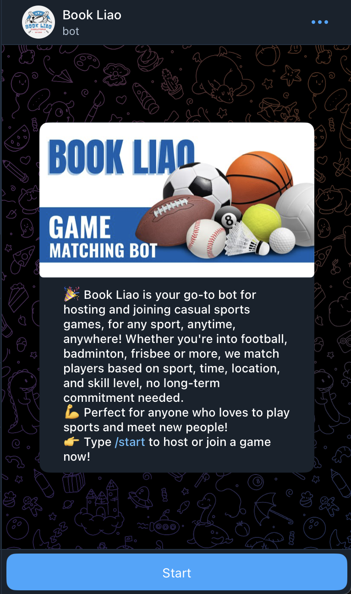
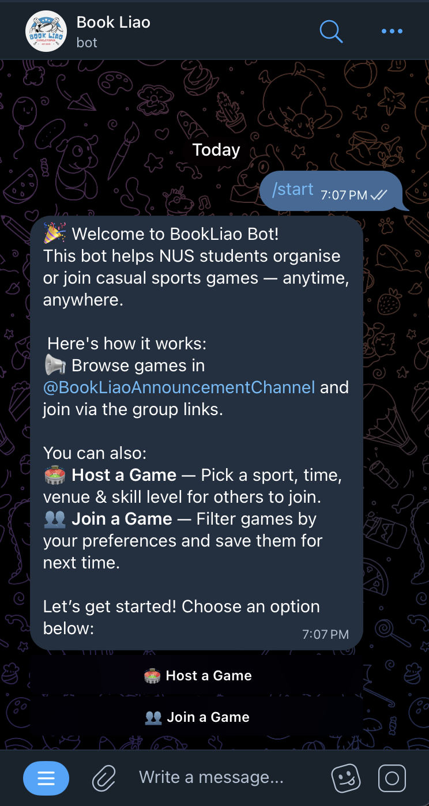
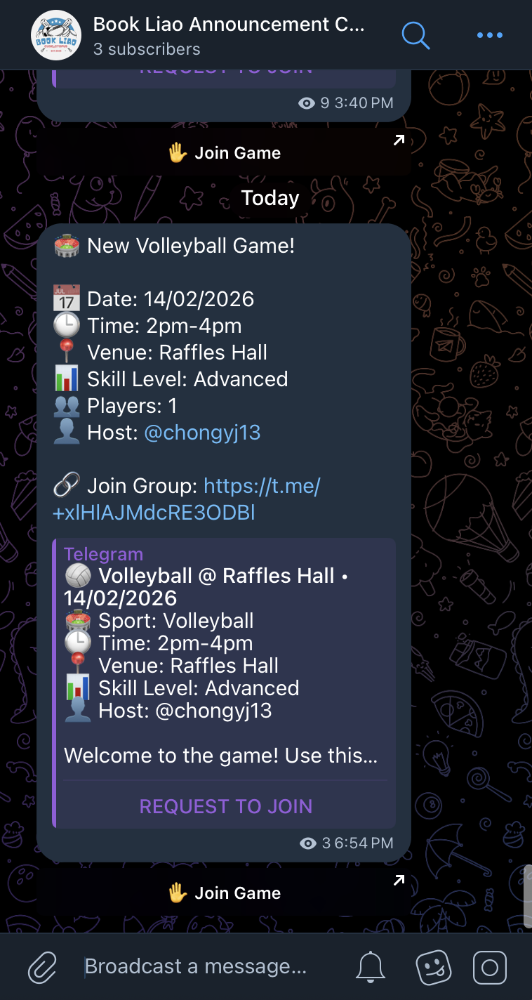

# BookLiao Bot

A Telegram bot that helps NUS students organise and join casual sports games — anytime, anywhere.

Pick a sport, set the time and venue, and the bot automatically creates a Telegram group, posts to an announcement channel, sends reminders, and tracks who's coming.

## Screenshots

<p align="center">
  <br/>
  <br/>
  
</p>

## Features

**Host a Game**

- Choose from 9 sports: Football, Basketball, Tennis, Volleyball, Badminton, Ultimate Frisbee, Floorball, Table Tennis, Touch Rugby
- Set date, time, venue, and skill level (Beginner / Intermediate / Advanced)
- Integrated venue booking links for NUS facilities and ActiveSG centres
- Smart venue autocomplete with fuzzy matching
- Auto-creates a Telegram group for each game
- Posts game announcements to [@BookLiaoAnnouncementChannel](https://t.me/BookLiaoAnnouncementChannel)

**Join a Game**

- Browse available games with filters: sport, skill level, date, time, venue
- Save your filter preferences for next time
- Join games directly through generated group links

**Automated Game Management**

- Game reminders at 24 hours and 2 hours before start
- Real-time member count tracking and announcement updates
- Automatic cleanup of expired games

## Tech Stack

| Component      | Technology                                                    |
| -------------- | ------------------------------------------------------------- |
| Bot Framework  | [python-telegram-bot](https://python-telegram-bot.org/) v22.1 |
| Group Creation | [Telethon](https://docs.telethon.dev/) v1.40.0                |
| Database       | Firebase Cloud Firestore                                      |
| Venue Matching | rapidfuzz + spaCy NLP                                         |
| Scheduling     | APScheduler (via PTB JobQueue)                                |

## Project Structure

```
bookliaobot/
├── bot/
│   ├── main.py                  # Entry point, bot setup, job scheduling
│   ├── handlers/
│   │   ├── createagame.py       # Game hosting conversation flow
│   │   ├── joingamehandlers.py  # Game joining entry point
│   │   ├── game_filters.py      # Filter and browse games
│   │   ├── hostedgames.py       # View/manage hosted games
│   │   ├── membertracking.py    # Member count tracking
│   │   └── user_preferences.py  # Saved filter preferences
│   ├── services/
│   │   ├── database.py          # Firestore database operations
│   │   ├── telethon_service.py  # Telegram group creation API
│   │   ├── reminder.py          # Game reminder scheduling
│   │   └── venue.py             # Venue search and autocomplete
│   └── utils/
│       ├── constants.py         # Sports, venues, conversation states
│       ├── datetime_helper.py   # Timezone handling (SGT)
│       ├── validation_helper.py # Input validation
│       └── groupid_helper.py    # Telegram group ID conversions
├── tests/
│   ├── unit/
│   └── integration/
├── requirements.txt
└── README.md
```

## Setup

### Prerequisites

- Python 3.9+
- A Telegram bot token from [@BotFather](https://t.me/BotFather)
- A Firebase project with Firestore enabled
- Telegram API credentials from [my.telegram.org](https://my.telegram.org/auth)

### Installation

1. **Clone the repository**

   ```bash
   git clone https://github.com/your-username/bookliaobot.git
   cd bookliaobot
   ```

2. **Create and activate a virtual environment**

   ```bash
   python3 -m venv venv
   source venv/bin/activate        # macOS/Linux
   venv\Scripts\activate           # Windows
   ```

3. **Install dependencies**

   ```bash
   pip install -r requirements.txt
   ```

4. **Set up Firebase**
   - Go to your Firebase Console > Project Settings > Service Accounts
   - Generate a new private key and save it as `.firebasekey.json` in the project root

5. **Set up Telegram API credentials**
   - Go to [my.telegram.org/auth](https://my.telegram.org/auth) and log in
   - Navigate to **API development tools**
   - Create a new application to get your API ID and API Hash

6. **Create a `.env` file** in the project root:

   ```env
   BOT_TOKEN=your_bot_token
   BOT_USERNAME=@YourBotUsername
   ANNOUNCEMENT_CHANNEL=@your_announcement_channel

   TELEGRAM_API_ID=your_api_id
   TELEGRAM_API_HASH=your_api_hash
   TELEGRAM_PHONE_NUMBER=your_phone_number

   FIREBASE_CREDENTIALS=.firebasekey.json
   ```

### Running the Bot

```bash
python -m bot.main
```

The bot runs using long polling — no server, domain, or webhook setup required. It works on any machine with Python and an internet connection.

### Running Tests

```bash
pytest tests/
```

## Bot Commands

| Command     | Description               |
| ----------- | ------------------------- |
| `/start`    | Open the main menu        |
| `/cancel`   | Cancel the current action |
| `/feedback` | Open the feedback form    |

## How It Works

1. A host creates a game by selecting a sport, date, time, venue, and skill level
2. The bot creates a dedicated Telegram group for the game via the Telethon API
3. An announcement is posted to the announcement channel with a join link
4. Players browse and filter games, then join via the group link
5. The bot tracks member counts and updates the announcement in real time
6. Reminders are sent 24 hours and 2 hours before the game
7. Expired games are automatically cleaned up every hour
